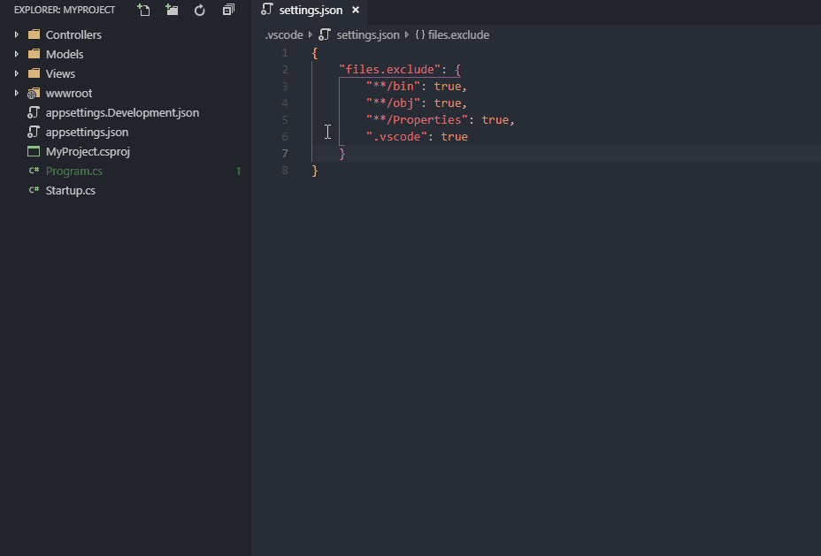

# Peek Hidden Files

Hide/show/toggle visibility of excluded files.

## Features

- Three commands - `Hide Excluded Files`, `Show Excluded Files` and `Toggle Excluded Files` available through Command Palette.
- `Toggle Excluded Files` in Explorer's context menu.

## Presentation

## Known Limitations

Won't work with conditional hiding.